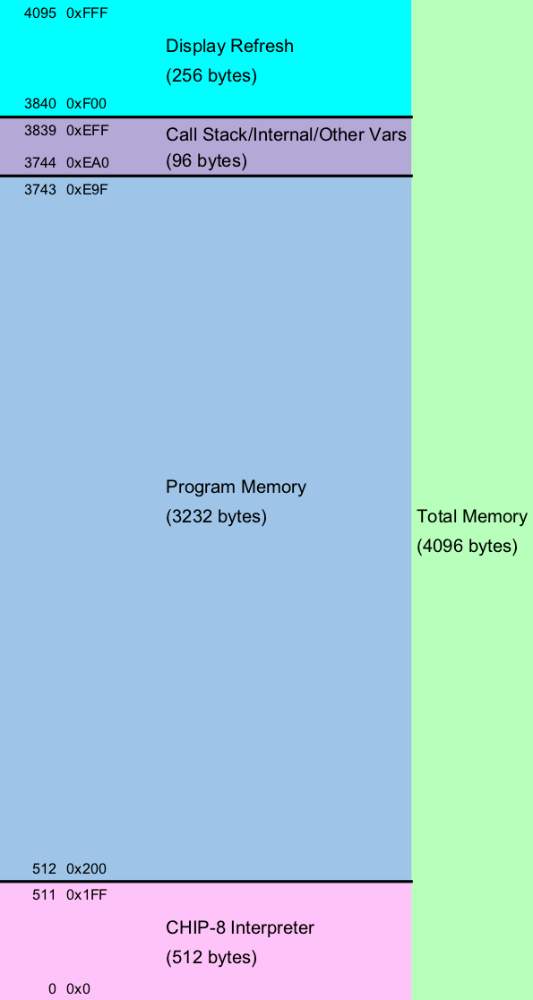

dgCHIP8
=======

A CHIP-8 emulator written in C.

## Libraries

* SDL2 - Graphics, sound, and input
* MinUnit - Unit testing

## CHIP-8 Memory Layout

## Resources

[Wikipedia article on CHIP-8](https://en.wikipedia.org/wiki/CHIP-8)

[How To Write a Computer Emulator](http://fms.komkon.org/EMUL8/HOWTO.html)

[CHIP-8 Reference](http://devernay.free.fr/hacks/chip8/C8TECH10.HTM)