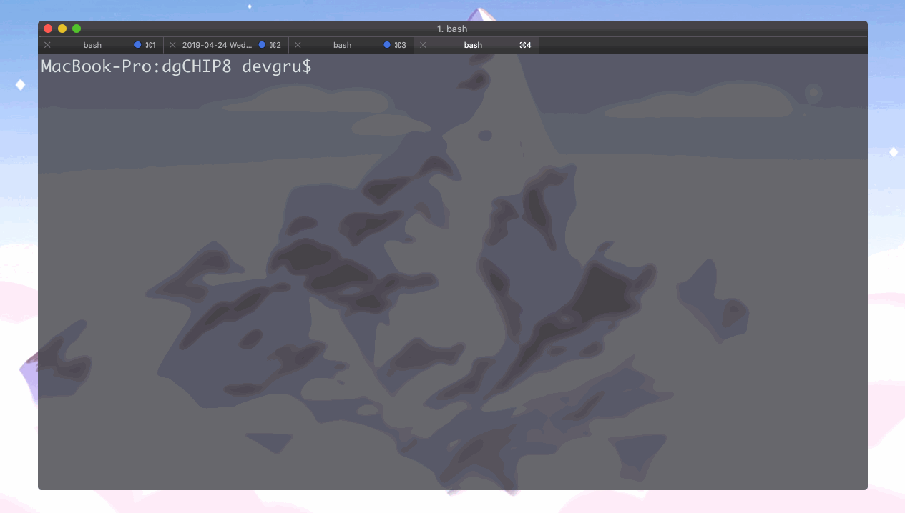

dgCHIP8
=======

A CHIP-8 emulator written in C. Includes some public domain CHIP-8 games in the `games/` directory.




## Libraries

* SDL2 - Graphics, sound, and input
* MinUnit - Unit testing

## Building (on macOS)

```bash
# install dependencies
brew install sdl2 sdl2_ttf sdl2_mixer

# build
cd dgCHIP8/
make clean all

# run
./dgCHIP8 <path/to/game>

```

## Controls

The CHIP-8 was designed for a 16-key hexadecimal keypad. This emulator uses the following mapping to a QWERTY keyboard:

```
 Keypad                  QWERTY
 --- --- --- ---         --- --- --- ---
| 1 | 2 | 3 | C |       | 1 | 2 | 3 | 4 |
 --- --- --- ---         --- --- --- ---
| 4 | 5 | 6 | D |       | Q | W | E | R |
 --- --- --- ---    ->   --- --- --- ---
| 7 | 8 | 9 | E |       | A | S | D | F |
 --- --- --- ---         --- --- --- ---
| A | 0 | B | F |       | Z | X | C | V |
 --- --- --- ---         --- --- --- ---
```

## Resources

* [CHIP-8 Reference](http://devernay.free.fr/hacks/chip8/C8TECH10.HTM)

* [How To Write a Computer Emulator](http://fms.komkon.org/EMUL8/HOWTO.html)

* [Wikipedia article on CHIP-8](https://en.wikipedia.org/wiki/CHIP-8)
  
* [(Super)CHIP 8 Secrets](https://github.com/AfBu/haxe-chip-8-emulator/wiki/(Super)CHIP-8-Secrets)
